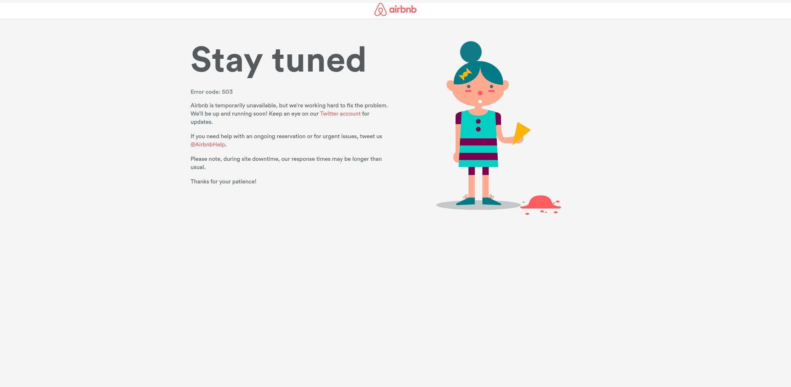
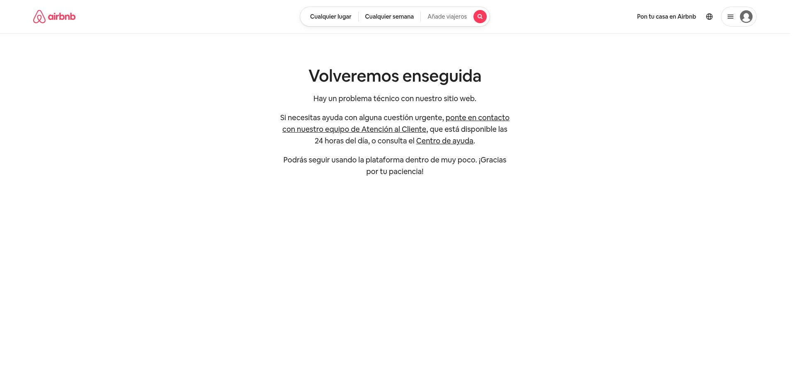
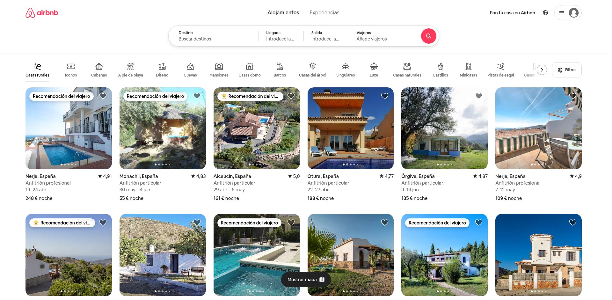

# Informe de Reconocimiento – HackerOne (Airbnb)

## Introducción

Este informe detalla la fase de reconocimiento realizada sobre el dominio `*.airbnb.com`, en el marco del programa de bug bounty disponible en HackerOne. El objetivo principal de esta fase fue identificar activos expuestos, subdominios válidos, endpoints accesibles y servicios potencialmente vulnerables relacionados con el dominio objetivo.

Para esta tarea se utilizó un script personalizado llamado `Illoware.sh`, diseñado para automatizar tareas comunes de reconocimiento pasivo y activo, integrando múltiples herramientas de código abierto en un solo flujo de trabajo. A continuación se describen las principales herramientas utilizadas y sus propósitos dentro del reconocimiento.

## Herramientas Utilizadas

El script `Illoware.sh` integra y automatiza el uso de las siguientes herramientas:

- **`dig` y `whois`**: Para recolección de información DNS y WHOIS sobre dominios y subdominios, incluyendo registros A, NS, MX y TXT.
- **`ctfr`**: Herramienta en Python que permite extraer subdominios desde transparencia de certificados (CT logs), útil para descubrimiento pasivo.
- **`gau` (Get All URLs)**: Permite recolectar URLs históricas expuestas públicamente desde servicios como Wayback Machine, Common Crawl, entre otros.
- **`katana`**: Crawler moderno y veloz escrito en Go, utilizado para explorar rutas accesibles dentro de los subdominios descubiertos.
- **`httpx`**: Verifica qué subdominios son accesibles por HTTP/HTTPS, además de extraer metadatos como encabezados, redirecciones y títulos.
- **`nmap`**: Realiza escaneo de puertos para detectar servicios y versiones corriendo en los subdominios activos.
- **`curl`**: Para comprobaciones básicas de respuesta HTTP.
- **`markmap`**: Herramienta visual para representar la estructura del reconocimiento en forma de mapas mentales (Markdown interactivo).
- **`figlet`**: Se utiliza para mostrar banners visuales durante la ejecución del script, sin impacto técnico.
- Además, se hace uso de dependencias como `gcc`, `go`, `python3`, `pip3`, `git`, y `npm` para instalar, compilar o ejecutar las herramientas anteriores.

Estas herramientas trabajan en conjunto para ofrecer un reconocimiento amplio y semiautomatizado, facilitando la identificación de superficies de ataque en `*.airbnb.com`.


## Reconocimiento Pasivo – DNS y Seguridad de Correo

Durante esta fase se recolectó información relacionada con la configuración DNS de `airbnb.com`, incluyendo políticas de seguridad aplicadas al correo electrónico y registros clave asociados al dominio.

Se identificó un registro **DMARC** con la siguiente configuración:

```
v=DMARC1; p=reject; sp=reject; pct=100; ruf=mailto:dmarc.forensic@airbnb.com; rua=mailto:dmarc.aggregate@airbnb.com; aspf=r; adkim=r; fo=1; ri=3600
```


Esta configuración indica que Airbnb aplica una política estricta de rechazo a correos no autorizados, tanto en el dominio principal como en los subdominios. Además, recopilan informes forenses y agregados para monitorear intentos de suplantación. También se verificaron registros SPF y DKIM, reforzando su postura de seguridad frente a phishing y spoofing.

### Registros A – Resolución de IP

Se resolvieron varias direcciones IP asociadas al dominio y sus subdominios:

- `44.223.197.210`
- `34.231.2.231`
- `54.243.237.216`

Estas direcciones están asignadas a infraestructura alojada en **AWS (Amazon Web Services)**, lo cual es consistente con el uso de servicios en la nube escalables y distribuidos.

### Registros MX – Correo Electrónico

El dominio utiliza los servicios de Google para la gestión del correo electrónico, mediante los siguientes registros **MX**:

- `1 aspmx.l.google.com.`
- `5 alt1.aspmx.l.google.com.`
- `5 alt2.aspmx.l.google.com.`
- `10 alt3.aspmx.l.google.com.`
- `10 alt4.aspmx.l.google.com.`

Esto indica que Airbnb utiliza **Google Workspace** (antes G Suite) para su correo corporativo.

### Registros NS – Servidores de Nombres

Los servidores de nombres responsables de la gestión del DNS para `airbnb.com` son una combinación de **NS1** y **AWS Route53**:

- `dns1.p08.nsone.net.`
- `dns2.p08.nsone.net.`
- `dns3.p08.nsone.net.`
- `dns4.p08.nsone.net.`
- `ns-1453.awsdns-53.org.`
- `ns-1932.awsdns-49.co.uk.`
- `ns-474.awsdns-59.com.`
- `ns-558.awsdns-05.net.`

Este enfoque híbrido mejora la disponibilidad y resiliencia del servicio DNS.

## Reconocimiento Activo – Descubrimiento de Endpoints

Se utilizaron herramientas como `gau` para recolectar URLs históricas asociadas al dominio, incluyendo endpoints potencialmente expuestos por desarrollos antiguos, versiones legacy, o archivos descontinuados. Estas URLs fueron posteriormente verificadas mediante `httpx`, filtrando únicamente aquellas que respondían correctamente y se encontraban activas.

El resultado de esta operación fue una lista depurada de rutas funcionales sobre el dominio `*.airbnb.com`, entre las que destacan:

- `https://www.airbnb.com/5083157`
- `https://www.airbnb.com/?af=2024894&c=fullbanner_01`
- `https://www.airbnb.com/?af=414650&c=re_=`
- `https://www.airbnb.com/?af=1922719&gclid=...`
- Rutas de tipo `mailto:` como:
  - `mailto:dpo@airbnb.com` – Dirección del Data Protection Officer (DPO), visible en múltiples URLs.

Estas rutas representan potenciales superficies de ataque que podrían ser auditadas en profundidad en fases posteriores del pentest o bug bounty.

Use gowitness para comprobar las urls conseguidas, fueron mas de 170k, no saque gran cosa, la gran mayoría de capturas eran asi.




Y las esperadas:



### Rango de IPs – Infraestructura de Red (RIPE)

Durante el análisis se identificaron los siguientes rangos de IP asociados mediante consultas a RIPE:

- `43.255.112.0 - 45.3.31.255`
- `32.0.0.0 - 36.255.91.255`
- `54.140.0.0 - 56.255.255.255`

Estos bloques representan posibles asignaciones a servicios cloud o redes utilizadas por Airbnb, ya sea directamente o a través de terceros (como AWS). Su análisis puede ser útil para futuros escaneos masivos, correlación con subdominios o verificación de exposición externa.


## Conclusión

La fase de reconocimiento realizada sobre el dominio `*.airbnb.com` ha permitido recolectar información valiosa mediante técnicas pasivas y activas. Gracias al uso del script `Illoware.sh`, se logró automatizar un flujo completo de descubrimiento de subdominios, verificación de servicios expuestos, análisis DNS, fingerprinting de tecnologías y recolección de endpoints válidos.

Se identificaron múltiples rutas funcionales accesibles públicamente, así como una infraestructura basada en AWS y servicios de correo gestionados por Google. La configuración DNS, incluyendo políticas DMARC, muestra una postura de seguridad madura, aunque persisten rutas históricas que podrían ser investigadas más a fondo.

Este reconocimiento establece una base sólida para fases posteriores de análisis de vulnerabilidades, fuzzing o pruebas específicas sobre aplicaciones y servicios descubiertos.

---
